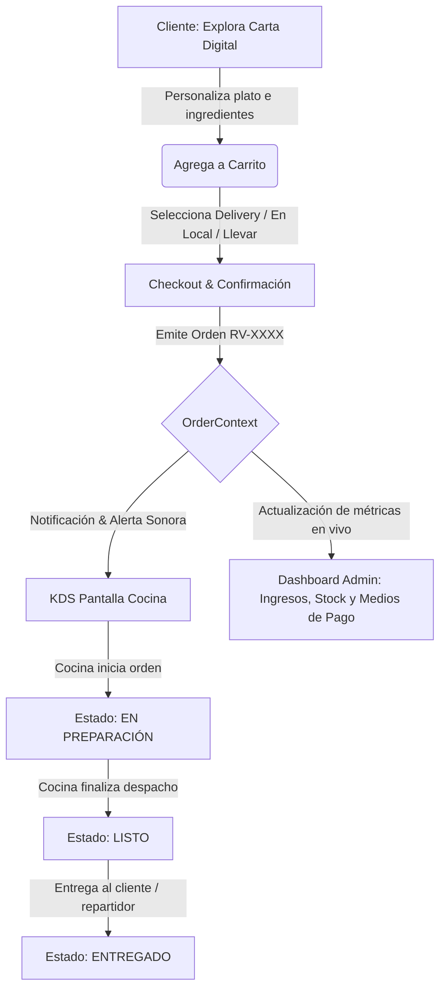

# 👑 REY-VEN — Gourmet Fast Food & Kitchen Display System (KDS)

<div align="center">

[](https://react.dev/)
[](https://www.typescriptlang.org/)
[](https://vitejs.dev/)
[](https://tailwindcss.com/)
[](LICENSE)

<p align="center">
  <strong>Plataforma integral de experiencia digital gastronómica, comandero digital en tiempo real (KDS) y panel administrativo para alta cocina rápida en Lima, Perú.</strong>
</p>

</div>

---

## 📌 Tabla de Contenidos

1. [Visión General](#-visión-general)
2. [Arquitectura y Roles](#-arquitectura-y-roles)
3. [Módulos Principales](#-módulos-principales)
   - [1. Experiencia Cliente & Carta Digital](#1-experiencia-cliente--carta-digital)
   - [2. KDS (Kitchen Display System)](#2-kds-kitchen-display-system)
   - [3. Dashboard Administrativo & Control de Stock](#3-dashboard-administrativo--control-de-stock)
4. [Flujo Operativo](#-flujo-operativo)
5. [Estructura del Repositorio](#-estructura-del-repositorio)
6. [Stack Tecnológico](#-stack-tecnológico)
7. [Puesta en Marcha](#-puesta-en-marcha)
8. [Créditos & Autor](#-créditos--autor)

---

## 🍗 Visión General

**REY-VEN** es una solución web de alto rendimiento diseñada para digitalizar de punta a punta la operación de un restaurante de comida rápida artesanal (especializado en Pollo Broaster crujiente, Hamburguesas gourmet al carbón y Salchipapas clásicas).

Combina una **landing page editorial de lujo con estética oscura y acabados dorados** (*CRAV-inspired*), un **catálogo interactivo con personalizador de platos y salsas tradicionales peruanas**, un **KDS de cocina reactivo** para reducir tiempos de espera y un **Dashboard de administración** para toma de decisiones y control de inventario en tiempo real.

---

## 👥 Arquitectura y Roles

La plataforma integra un sistema de conmutación de roles dinámico sin recarga (`RoleLoginModal`):

| Rol | Alcance | Funcionalidades Clave |
| :--- | :--- | :--- |
| **Cliente** | Experiencia de usuario final | Navegación editorial, personalización de salsas/extras, carrito deslizable y emisión de pedidos (Delivery / En Local / Para Llevar). |
| **Cocina (KDS)** | Terminal de operaciones de preparación | Vista Kanban de comandas activas, timer transcurrido por orden, alertas sonoras y transición de estados (`PENDIENTE` ➔ `EN_PREPARACION` ➔ `LISTO` ➔ `ENTREGADO`). |
| **Administrador** | Gestión de negocio y logística | Métricas financieras (Venta total, Ticket promedio), distribución por método de pago (Yape, Plin, Efectivo, POS) y matriz de disponibilidad de insumos en tiempo real. |

---

## 🚀 Módulos Principales

### 1. Experiencia Cliente & Carta Digital
- **Editorial Hero & Storytelling**: Secciones inmersivas con tipografía de alto impacto (`EditorialHero`, `GoldenCrownSection`, `IngredientsParallaxSection`).
- **Personalizador de Platos (`DishCustomizerModal`)**:
  - Selección de piezas específicas (Pecho, Pierna, Ala, Encuentro).
  - Matriz de salsas caseras: *Mayonesa Secreta, Tártara de la Casa, Ají Pollero Leyenda, Rocoto Furia Red, Crema Aceitunada*.
  - Agregados dinámicos: *Huevo a la inglesa, Plátano frito, Queso fundido Danbo, Tocino crujiente*.
- **Carrito Deslizable (`CartDrawer`)**: Resumen dinámico, cálculo de suplementos en moneda local (PEN - S/) y selección de método de despacho y pago.

### 2. KDS (Kitchen Display System)
- **Monitoreo en tiempo real**: Tarjetas visuales de pedidos organizadas por prioridad temporal.
- **Alertas acústicas**: Sistema de notificación sonoro activable para ingreso de nuevas comandas.
- **Filtros rápidos**: Segmentación instantánea por estado operativo para evitar cuellos de botella en la línea de fritura y armado.

### 3. Dashboard Administrativo & Control de Stock
- **Métricas Clave**:
  - Ingresos brutos consolidados en Soles (PEN).
  - Número de comandas procesadas vs. activas.
  - Ticket promedio en tiempo real.
- **Desglose de Medios de Pago**: Yape, Plin, Efectivo y Tarjetas POS.
- **Matriz de Stock (`StockManagerTable`)**: Switch inmediato para pausar o reactivar productos e ingredientes con reflejo instantáneo en la carta del cliente.

---

## 🔄 Flujo Operativo



---

## 📁 Estructura del Repositorio

```text
Rey-Ven/
├── public/                     # Assets públicos estáticos
├── src/
│   ├── components/
│   │   ├── admin/              # Dashboard administrativo y tabla de stock
│   │   │   ├── AdminDashboard.tsx
│   │   │   └── StockManagerTable.tsx
│   │   ├── client/             # Experiencia de compra del cliente
│   │   │   ├── CartDrawer.tsx
│   │   │   ├── DishCustomizerModal.tsx
│   │   │   ├── HeroCinematic.tsx
│   │   │   └── MenuCatalog.tsx
│   │   ├── kitchen/            # Pantalla de cocina (KDS)
│   │   │   ├── KDSScreen.tsx
│   │   │   └── OrderCardKDS.tsx
│   │   ├── landing/            # Secciones editoriales de alto impacto visual
│   │   │   ├── EditorialFooter.tsx
│   │   │   ├── EditorialHero.tsx
│   │   │   ├── FinalImpactCTA.tsx
│   │   │   ├── GoldenCrownSection.tsx
│   │   │   ├── IngredientsParallaxSection.tsx
│   │   │   ├── InitialLoader.tsx
│   │   │   └── LimaDeliverySection.tsx
│   │   └── layout/             # Navbar global y modal de selección de rol
│   │       ├── Navbar.tsx
│   │       └── RoleLoginModal.tsx
│   ├── context/                # Estado global reactivo
│   │   ├── AuthContext.tsx     # Manejo de roles de usuario
│   │   ├── CartContext.tsx     # Estado del carrito y modificaciones
│   │   └── OrderContext.tsx    # Ciclo de vida completo de comandas
│   ├── data/                   # Datos semilla del restaurante y carta
│   │   ├── mockAssets.ts
│   │   ├── mockMenu.ts
│   │   └── mockOrders.ts
│   ├── types/                  # Contratos de tipos TypeScript
│   │   ├── menu.ts
│   │   ├── order.ts
│   │   └── user.ts
│   ├── App.tsx                 # Enrutador por roles y contenedor principal
│   ├── index.css               # Directivas base y utilidades de Tailwind
│   └── main.tsx                # Punto de entrada de React
├── index.html                  # Plantilla HTML5 con fuentes pre-cargadas
├── package.json                # Dependencias y scripts de construcción
├── tailwind.config.js          # Paleta personalizada (dorados, negros profundos)
├── tsconfig.json               # Configuración estricta de TypeScript
└── vite.config.ts              # Configuración optimizada de Vite
```

---

## 🛠️ Stack Tecnológico

| Capa | Tecnología | Propósito |
| :--- | :--- | :--- |
| **Framework** | [React 18.3](https://react.dev/) | Renderizado reactivo y desacoplamiento de componentes modulares. |
| **Lenguaje** | [TypeScript 5.7](https://www.typescriptlang.org/) | Tipado estático estricto para entidades gastronómicas y pedidos. |
| **Bundler** | [Vite 6.0](https://vitejs.dev/) | HMR instantáneo y empaquetado optimizado para producción. |
| **Estilos** | [Tailwind CSS 3.4](https://tailwindcss.com/) | Diseño responsivo moderno, paleta de lujo y animaciones fluidas. |
| **Iconografía** | [Lucide React](https://lucide.dev/) | Sistema de iconos coherente y liviano. |
| **Efectos** | [Canvas Confetti](https://www.npmjs.com/package/canvas-confetti) | Microinteracciones de celebración en confirmación de compras. |

---

## ⚡ Puesta en Marcha

### Prerrequisitos
- **Node.js** (versión 18.0 o superior recomendada)
- **npm** o **pnpm**

### Instalación

1. **Clonar el repositorio:**
   ```bash
   git clone https://github.com/ProgramaGrueso/Rey-Ven.git
   cd Rey-Ven
   ```

2. **Instalar dependencias:**
   ```bash
   npm install
   ```

3. **Ejecutar el servidor de desarrollo:**
   ```bash
   npm run dev
   ```
   Abre tu navegador en `http://localhost:5173` para explorar la aplicación.

4. **Compilar para producción:**
   ```bash
   npm run build
   ```
   Los artefactos optimizados se generarán en la carpeta `dist/`.

---

## 👨‍💻 Autor & Organización

- Desarrollado por **[ProgramaGrueso](https://github.com/ProgramaGrueso)**.
- Hecho con pasión culinaria y excelencia de software en Lima, Perú.
